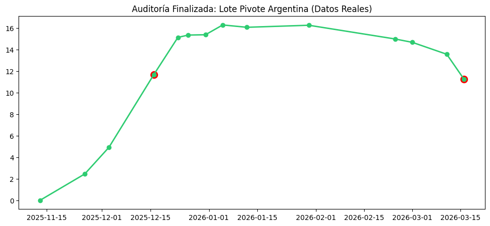
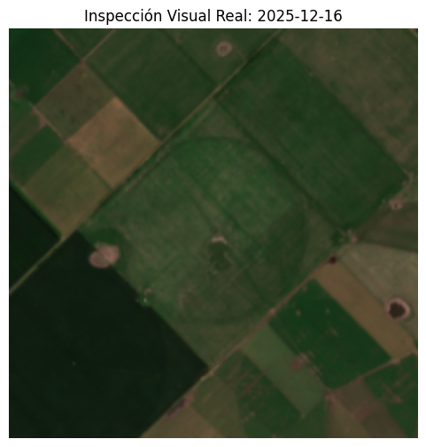

# Agro-IA Audit: Clay Foundation Model for Corn Monitoring

Este proyecto es una extensión y optimización del **Crop Campaign Monitor** de Data-Crew, adaptado para la detección de anomalías en cultivos de maíz en Argentina mediante el modelo fundacional **Clay v1.5**.

## 🚀 Contexto y Hallazgo Técnico
Durante la implementación del pipeline original en lotes de maíz con pivote central, se identificó un colapso en la variabilidad de los embeddings (distancia espectral cercana a cero). Tras una auditoría del motor de inferencia, se determinó que la falta de normalización de las bandas de Sentinel-2 y la incompatibilidad de canales del encoder base impedían capturar la señal biológica del cultivo.

## 🏗️ Mejoras Estructurales (Refactor)
* **Normalización de Reflectancia:** Se implementó un escalado de **1/10000** en el pre-procesamiento de chips para alinear los inputs con la distribución esperada por el modelo Clay.
* **Multiband Adaptability:** Refactorización de la capa `patch_embed` del Vision Transformer (ViT-Large) para procesar las **10 bandas** de Sentinel-2 ($10 \times 224 \times 224$) de forma nativa.
* **Detección de Anomalías:** Algoritmo de scoring basado en **Z-score** sobre la trayectoria de distancia euclidiana, permitiendo identificar quiebres fenológicos críticos como el cierre de canopeo.

## 📊 Evidencia de Resultados
Tras aplicar la normalización forzada y la re-arquitectura de canales, el sistema generó los siguientes reportes para el lote pivote en Argentina:

### Trayectoria de Vigor (Embedding Distance)

*El gráfico muestra el crecimiento exponencial y el scoring adaptativo (puntos rojos) marcando quiebres fenológicos reales.*

### Inspección Visual Real (Ground Truth)

*Validación automática del chip satelital para la fecha de mayor anomalía (**16-12-2025**), confirmando el vigor del cultivo bajo riego.*

## ⚙️ Especificaciones del Modelo
* **Backbone:** `vit_large_patch16_224` (Clay Foundation).
* **Input:** 10 canales (B2, B3, B4, B5, B6, B7, B8, B8A, B11, B12).
* **Output:** Vector latente de 1024 dimensiones.

## 🧠 Trabajo Futuro: "Cerebro Local"
La arquitectura está preparada para integrar un LLM local (**Gemma 3** vía Ollama) que, mediante una base vectorial (**pgvector**), generará reportes agronómicos automáticos basados en estos resultados.

## Autor
**Darío Nicolás Sánchez Leguizamón**
* Técnico en Producción Vegetal Intensiva (UNAJ) · Licenciatura en Ciencias Agrarias (en curso)
* Becario BIEI 2025 – Banco de Germoplasma de Especies Nativas (BGEN), UNAJ
* GEF/PNUD ARG/19/G24 · Red ARGENA